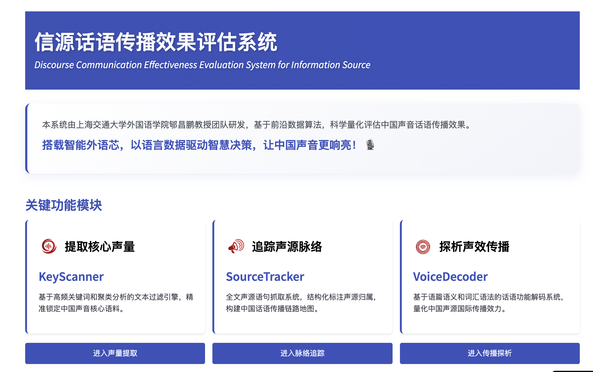

# *Discourse Communication Effectiveness Evaluation System for Information Source*

 

An **interactive web app** built with **Streamlit**, designed to explore **evidentials** through **local grammar analysis** and **fine-tuned language models**.  

  

---
##  Features

- **Interactive Data Visualization**  
  Explore the distribution of English reporting verbs and their local grammatical patterns.

- **AI-Powered Analysis**  
  Combines rule-based and deep learning approaches to achieve precise identification and annotation of reporting verbs in discourse.

- **Fast Deployment with Streamlit**  
  Deploy locally or on the cloud within minutes.

- **Research-Oriented Workflow**  
  Provides a reproducible framework for quantitative study of evidentiality in news and academic discourse.

  
  
  

---
##  Installation 

Clone the repository and install dependencies (skipping for option 1):

	git clone https://github.com/PseudoInsider/autoRecognition.git
	cd directory [where you save autoRecognition.git]
	pip install -r requirements.txt

---
##  Deployment
Running the App
- Option 1: visit our web app directly
	https://autorecognition.streamlit.app/ then upload your files

- Option 2: after installation, start the app locally by run
	`streamlit run main.py` in your terminal or cmd
	then open your browser at http://localhost:8501.

- Option 3：run the app on Streamlit Community Cloud 
	- Example for Streamlit Cloud
	- Push your code to GitHub
	- Sign in at share.streamlit.io
	- Deploy your repo and select app.py

---

## Project Structure

	.
	├── main.py             # Main Streamlit app
	├── requirements.txt    # Dependencies
	├── other               # Related attachments
	└── README.md           # Documentation
	└── Test_data           # Sample data used for test
---

## Research Background

This app is part of a study addressing the methodological gap in local grammar analysis of evidentiality. Existing research often lacks objective, quantitative tools, limiting discourse-functional insights.

To overcome this, our approach integrates:
1. Local grammar & construction grammar frameworks
		Fine-tuned language models for automatic recognition of reporting verbs
2. Hybrid rule-based + deep learning methods for accurate functional annotation; The model achieves an overall **F1 score of 90.78%**, demonstrating both accuracy and stability.
3. This work deepens the epistemic analysis of evidentiality in knowledge discourse, proposes an expandable quantitative framework, and contributes to improving precision in local grammar analysis and research on information dissemination.

## Contributing

We welcome contributions!
	
- Fork the repo
- Create a feature branch	
- Submit a Pull Request
- Give us a star ⭐︎

## License
This project is licensed under the MIT License.

If you use this app or the underlying methods in your research, please cite our work:

- Huan, C., & Wang, L. (Accepted). The application of language model fine-tuning techniques to local grammar: Automated recognition of evidentials. *Foreign Languages and their Teaching*. 
- Huan, C., & Wang, L., 2025. Discourse Communication Effectiveness Evaluation System for Information Source. [2025SR1448391]. National Copyright Administration of the People's Republic of China. Available at https://github.com/PseudoInsider/autoRecognition.git

## Disclaimer

This application is provided as is without any guarantees or warranty.
Use it at your own risk. The authors and contributors are not responsible for:

- Any damages, losses, or issues arising from the use of this app
- The accuracy, completeness, or reliability of data and outputs
- Misuse of the app for unintended or unlawful purposes

If any test data, examples, or other content in this project impinge on your rights, please contact us, and we will promptly remove or replace the material.